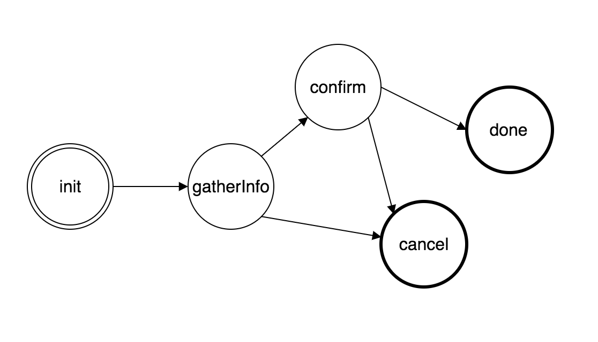
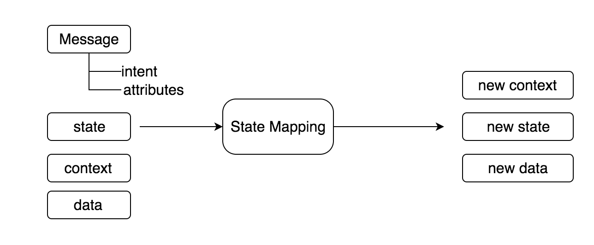

State represents the stage of the conversation. Imagine you are a Customer Service agent, you will provided with an SOP that requires you to respond appropriately in every state / stage of conversation. The state concept is basically a finite state machine with initial and end states.



We have discussed the three conversation phase: intent recognition, state mapping and action selection. In the state mapping phase, the parsed message together with current state, context and data will be mapped into a new state, updated context, and data.



A state can have an action or multiple actions attached that is being triggered at the end of state mapping lifecyle.

## Lifecycle

The lifecycle of a state mapping process is following:

1.  It starts from the last state (or init state if no last state is found)
2.  It will execute transit mapping, if it is defined
3.  It will search for available transition that meet condition, otherwise it will choose the fallback transition
4.  If a transition is chosen, it will execute transition mapping
5.  It will execute exit mapping
6.  It will execute enter mapping of the next state
7.  it will return the updated state, context and data
8.  The actions of the new state will be triggered

## Initial State

Every state mapping process must start from a state. If a flow is newly created, then it will start from the initial state. A flow can only have one initial state. There is two styles of initial state: the so called pitcher init or guardian init.


The pitcher init is an initial state that only used to start a flow and will never be revisited again. This style of init doesn't need to have an action attached, since it will never be the destination state.

```yaml
states:
  init:
    initial: true
    transitions:
      hi:
        condition: content == "hi"
      sorry:
        fallback: true
```

The second style is guardian init. This type of initial state will be revisited, until certain outcome (context change) is reached. Since this kind of init can be the destination state, it must have action attached.

```yaml
states:
  inquireName:
    initial: true
    transitions:
      inquirePhone:
        condition: context.name
      inquireName:
        fallback: true
```

## End State

A flow shall have at least one end-state. End state will cause a flow to be closed, which means that all the context associated with that flow will be erased. The flow will neither exist in the flow stack nor in the current flow anymore. A closed flow can be reopened with message that trigger its initial intent.

```yaml
states:
  close:
    end: true
    action: thankYou
```

An end state doesn't have to have a transition, since from there you can't get nowhere else.

## Transition

In every conversation, a state must go to its next state, even if the next state is the same state as the previous. To accomodate the state movement, transitions need to be defined. The state mapper process will do following procedure in selecting transition:

1.  It will select possible transitions with matching conditions
2.  If more than one transitions are selected, it will choose one with higher priority or higher order
3.  If no transition is selected, then it will select fallback transition

```yaml
transitions:
  stateA:
    condition: context.a == 1
  stateB:
    condition: context.a == 2
  stateC:
    fallback: true
```

Note: since the system require next state to be defined, a fallback transition shall be defined for every state.

## Mapping

Mapping is a process of updating the context and data. The mapping syntax is a key-value pair where the key is the context / data variables you want to be updated and the value is the value that you want to be mapped into the variable of your choice. Example:

```yaml
myState:
    transit:
        context.person.name: attributes.name || context.person.name
```

You can use valid javascript expression in the mapping. You can also define nested fields in the key part. There are multiple lifecycle events where you can put your mappings:

- `transit` before selecting transition
- `transition mapping` during transition
- `exit` after selecting transition
- `enter` after moving into new state

Following variables can be accessed:

- `content` message content
- `payload` message payload
- `type` message type
- `metadata` message metadata
- `intent` message intent
- `attributes` message attributes
- `context` flow context
- `data` session data

Additional meta context accessible in states at `context.<meta>`:

- `start : boolean` true if state is initial state
- `to : string` describe destination state. Available during exit
- `from : string` describe origin state. Available during enter
- `end : boolean` true if state is end state

## Floating State

Occasionally you will get into case where you need to put transition from many states to a particular state. E.g. cancel state. To simplify those cases, you can define a floating state. A floating state is a state that is reachable from all other states. When you define a state to be a floating state, the system will automatically create transitions from every other states to that state.

```yaml
states:
  cancel:
    float:
      condition: intent == "cancel"
```
