## Introduction

In this tutorial, we will create a simple conversation bot and integrated to NL studio. For pre-condition, you must create a bot by follow this tutorial in here [Bot studio tutorial](/tutorial/bot-studio/). You will create a NLModel which able to process pizza ordering orders. Further explanation for NLStudio, you may see in here [NL Studio Guideline](/tutorial/nl-studio/)

Let's start !

## Create Entity

Assumed you already logged in and visit your project. Go to NL Studio menu by click NL menu

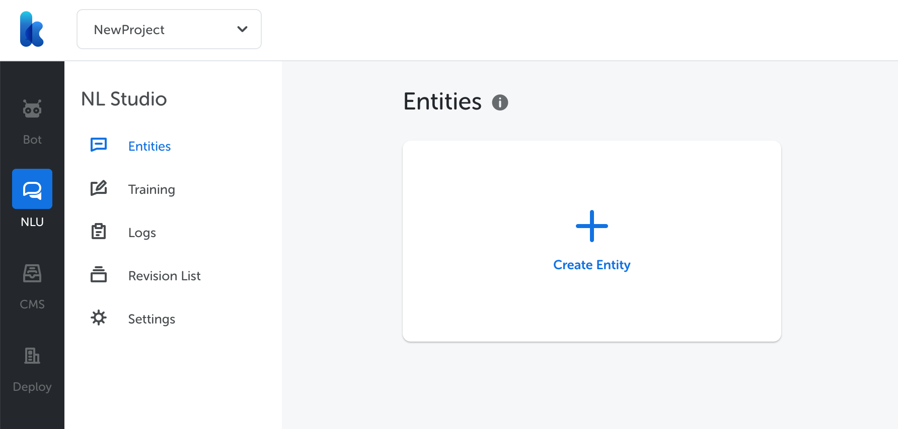

Then, click on Create Entity to start.

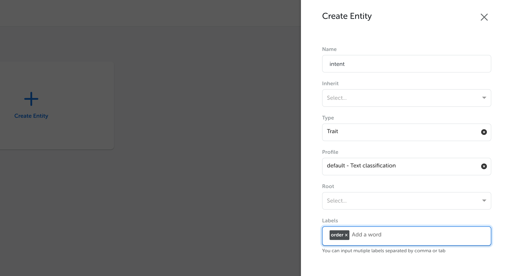

Click on Create. Here is a view after you create intent `entity`

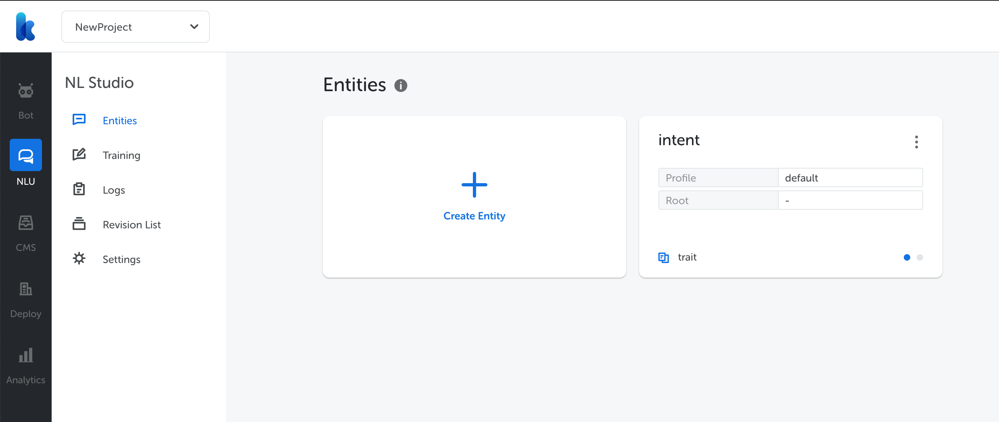

## Conduct Data Training

After you created the entity, the next step is data training. You have to enter a sentence to train `intent` trait. Click on Training menu

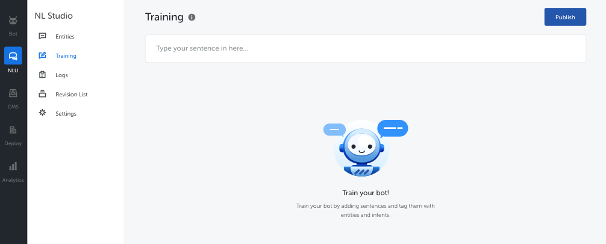

Then, you are able to enter sentence to train data. Put a sentence “I want to order pizza” and press enter in your keyboard

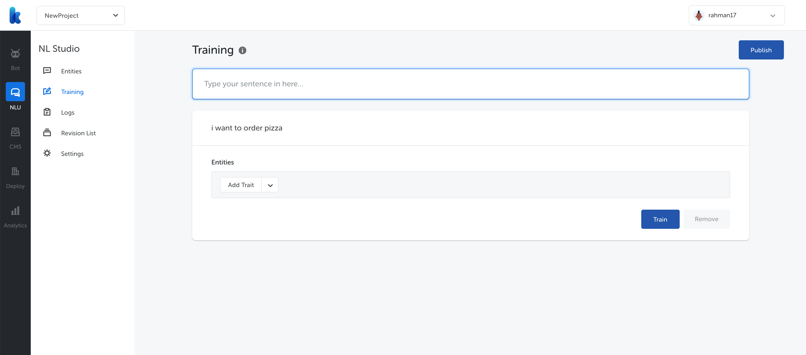

Afterward, click on Add Trait and select `intent:order`.

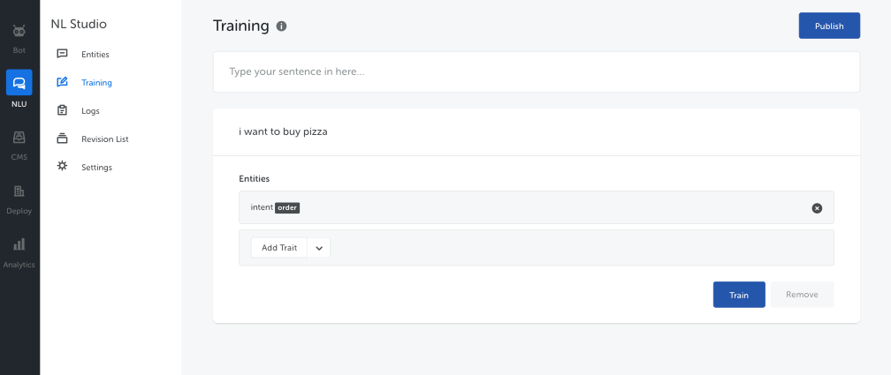

Next, click “Train” button to train entity you has created. The final display will look like this

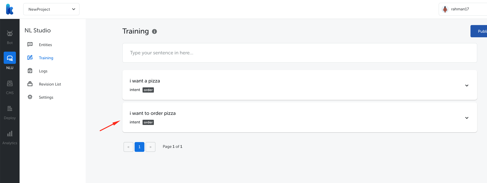

Entity shall train a lot for precisely understanding user's input, if you're doing training data in several sentences.

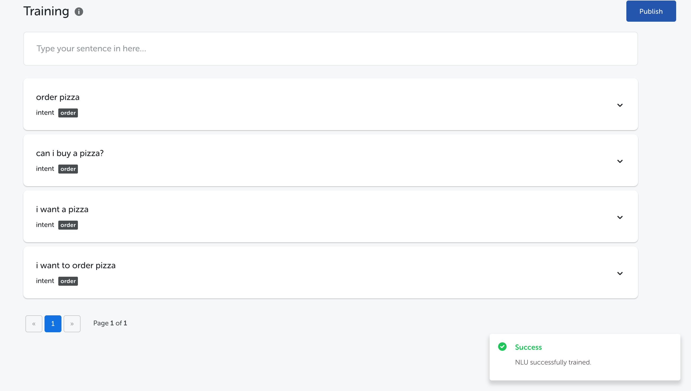

If you've done enough training, you are able to try testing by click "Test NLU" button. This feature will support you to predict more data.

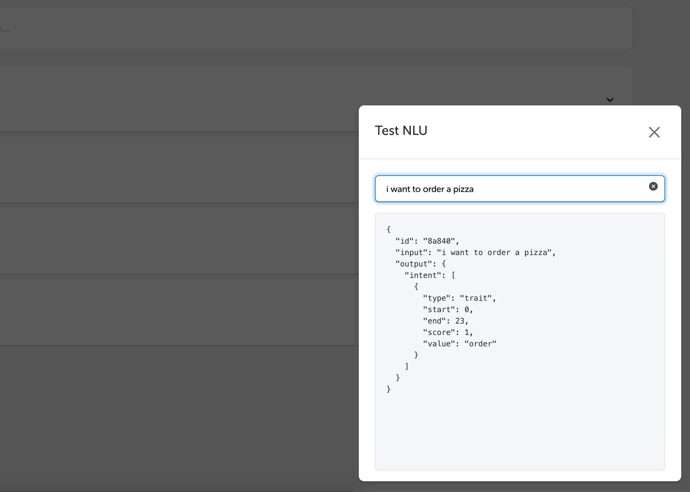

## Publish Your NL

Then, publish your NL for save training data and NL model.

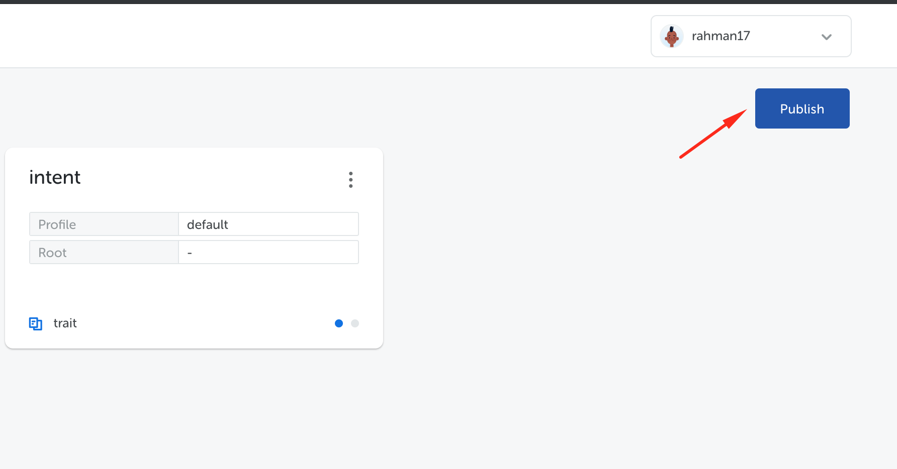

## Integration with NLUs

Next step is start integration with your bot using created entity. To get started, go to Bot menu and click NLUs sub-menu.

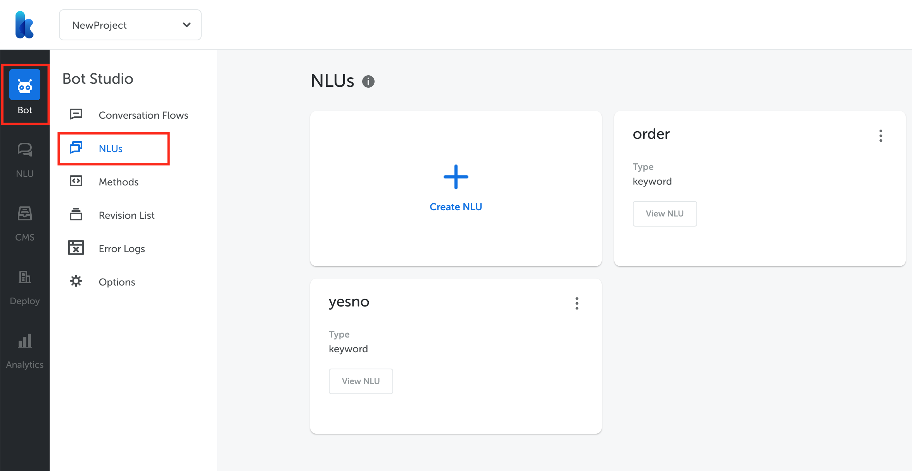

Click on Create NLU and fill in as follow

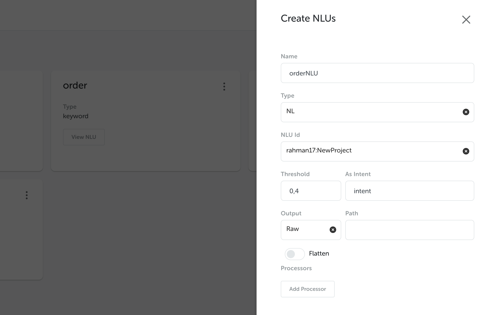

NLUid is found in NL menu in Setting. Click on NL menu, then click Settings

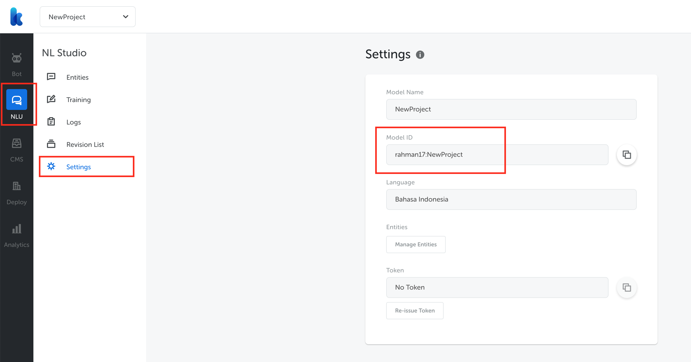

Afterward, copy NLUid into NLUid field in Create NLU drawer as follow

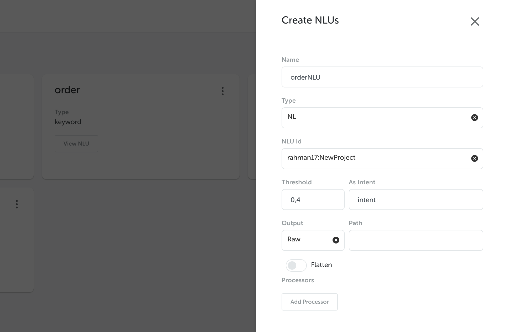

Click Create to continue. Successfully created NLUs will be appeared as follow

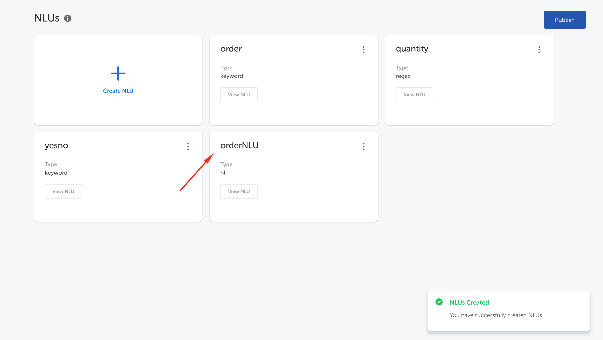

## Integration with Bot

Next, go to Conversation Flows and click on tab Intents. Select `orderTxt` that you've created earlier to handle user input (you may see this tutorial [Bot studio tutorial](/tutorial/bot-studio/)), then add a new classifier as below

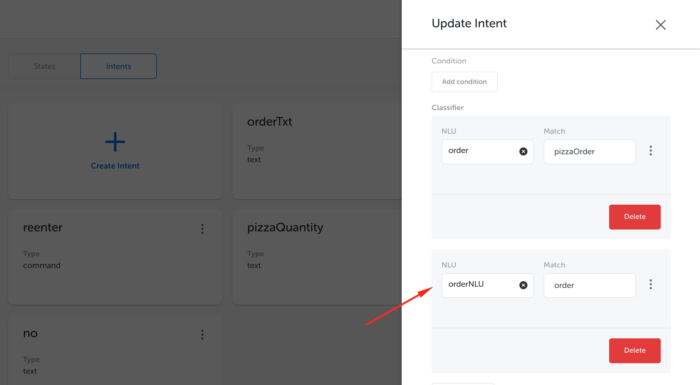

Click Update to save updated Intent.

## Testing Your Bot

Click on Publish bot to save your bot.

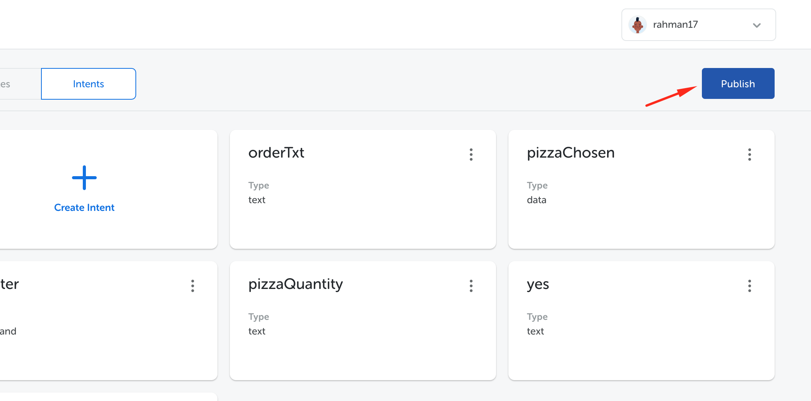

Voila, your bot is successfully integrated. Let's start in bot emulator.

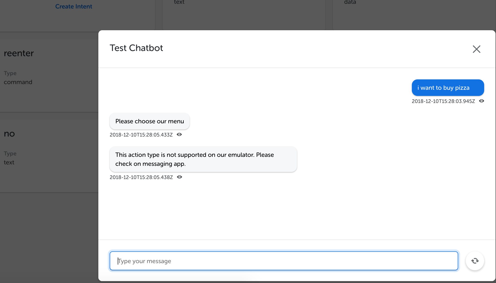
